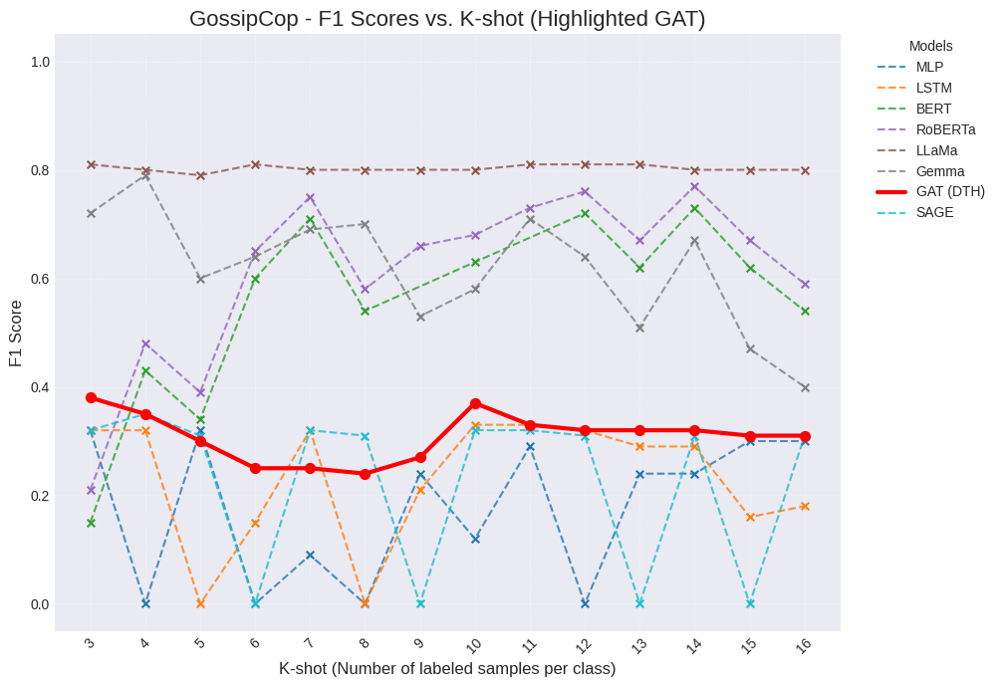

# GemGNN: Generative Multi-view Interaction Graph Neural Networks for Few-shot Fake News Detection

Check [installation guide](#installation) to run the code.

## Overview
- Few-shot: N-way-K-shot 
  - N(number of classes): 2 (real/fake)
  - K(number of samples per class): 3~16
- Transductive GNN: All nodes (labeled/unlabeled train/test) are used during training for message passing.
- Loss: Calculated only on labeled nodes.
- Evaluation: Performed on test nodes.
## Metrics
- Accuracy: $\frac{TP + TN}{TP + TN + FP + FN}$

- Precision: $\frac{TP}{TP + FP}$

- Recall: $\frac{TP}{TP + FN}$

- F1-Score: $2 \cdot \frac{Precision \cdot Recall}{Precision + Recall}$ (main metric)

## Results
<!-- 
 -->


## Dataset

[Fake_News_GossipCop](https://huggingface.co/datasets/LittleFish-Coder/Fake_News_GossipCop)

[Fake_News_PolitiFact](https://huggingface.co/datasets/LittleFish-Coder/Fake_News_PolitiFact)

## Usage

### GNN (HAN, HGT)
- build and train heterograph
```bash
python build_hetero_graph.py --k_shot 3 --dataset_name politifact --embedding_type deberta --edge_policy label_aware_knn --enable_dissimilar --multi_view 3
```
```bash
python train_hetero_graph.py --graph_path <graph_path> --model HGT
```

## Installation

- Create a new conda environment
```bash
conda create -n fakenews python=3.12
conda activate fakenews
```

- Install PyTorch (based on your CUDA version)
[(Official Doc)](https://pytorch.org/get-started/locally/)
```bash
conda install pytorch torchvision torchaudio pytorch-cuda=12.1 -c pytorch -c nvidia
```

- Install PyTorch Geometric [(Official Doc)](https://pytorch-geometric.readthedocs.io/en/latest/install/installation.html)

```bash
pip install torch-geometric
```

- Install other dependencies
```bash
pip install -r requirements.txt
```